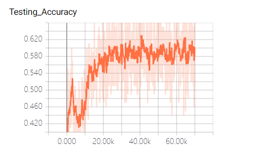

# Open_set_domain_adaptation

Tensorflow Implementation of 《Open Set Domain Adaptation by Backpropagation》

On SVHN->MNIST and MNIST->USPS, USPS->MNIST

## Usage:

python osda_train.py

## Major Difference: Flip the sign of L_adv(xt) 
# (After confirmation with the authors, my thoughts are correct!)

### paper: 
Ladv(xt) = tlog(p(y = K + 1|xt)) + (1 − t) log(1 − p(y = K + 1|xt)

C: Ls(xs, ys) + Ladv(xt)

G: Ls(xs, ys) - Ladv(xt)

### my implementation:
Ladv(xt) = -(tlog(p(y = K + 1|xt)) + (1 − t) log(1 − p(y = K + 1|xt))

C: Ls(xs, ys) + Ladv(xt)

G: Ls(xs, ys) - Ladv(xt)

## Results:
(ALL performance is reported,i.e., 6 classes classification--[0,1,2,3,4,unknown])

I have obatined ALL(overall accuracy) of near 0.60 for SVHN->MNIST while 0.71 is reported in paper. I'm trying to fix this gap at present. Any advice is welcome.  

